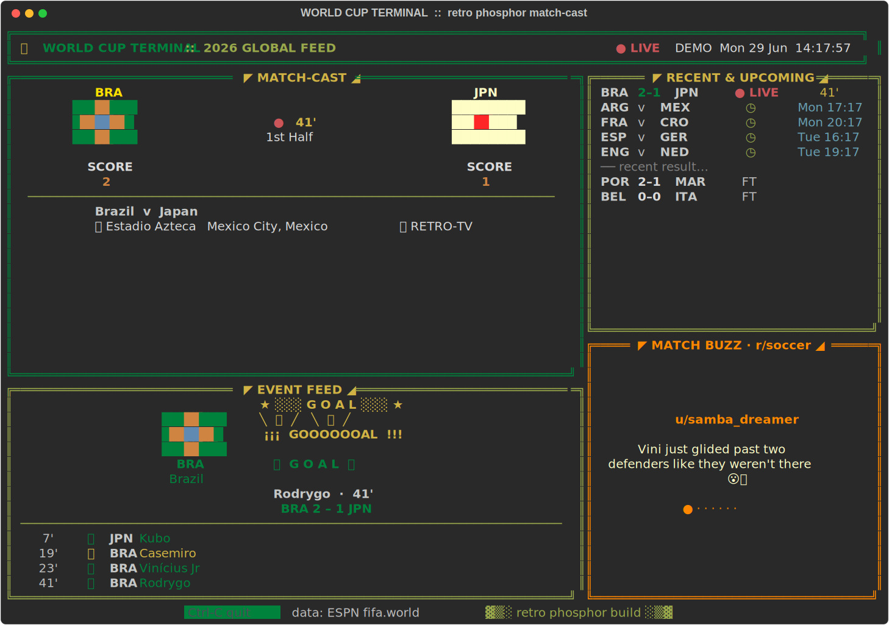
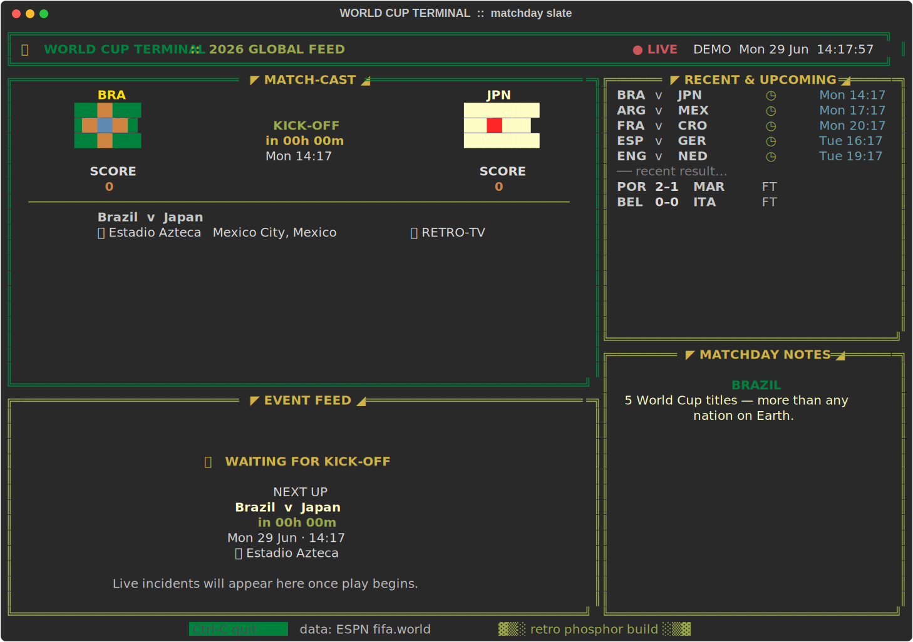

<div align="center">

# ⚽ World Cup Terminal

### A live, retro‑phosphor FIFA World Cup match‑cast that runs entirely in your terminal.

Dot‑matrix scoreboard · ASCII national flags · goal & card bursts (with a real terminal bell) ·
a live event feed · today/tomorrow fixtures · and a rotating **culture / news / r/soccer** ticker
that takes over during the slow moments of a match.




<sub>↑ a live frame: Brazil v Japan, the moment Rodrygo scores at 41' — captured straight from the app.</sub>

</div>

---

It's the whole tournament, rendered in glowing green text: a big dot‑matrix score, ASCII flags,
a live clock or kick‑off countdown, goals that flash a `GOOOOOOAL` burst and ring your terminal
bell, and a buzz rail that pulls real r/soccer match‑thread chatter. No GUI, no API key, no
account — just `python worldcup.py`.

---

## ✨ The feature guide

Every screen is built from six live panels. Here's the matchday slate, with each panel called out:



| # | Panel (on‑screen title) | What it shows |
|---|-------------------------|---------------|
| 1 | **◤ MATCH‑CAST ◢** | The hero board — big dot‑matrix score, ASCII flags for both nations, and a live clock, `FULL TIME`, or a `KICK‑OFF` countdown. Venue & TV underneath. |
| 2 | **◤ RECENT & UPCOMING ◢** | Today + tomorrow's fixtures with live scores, kick‑off times, and pinned recent results. A `▾ +N more` cue appears when the list is taller than the panel. |
| 3 | **◤ MATCHDAY NOTES ◢** | The right rail. During a live match it becomes **MATCH BUZZ · r/soccer** (real fan comments); otherwise it rotates ESPN headlines and a curated culture/trivia deck. |
| 4 | **◤ EVENT FEED ◢** | Live incidents parsed from ESPN play‑by‑play — goals, cards, subs. A goal triggers an ASCII burst (with the scoring nation's flag) **and** rings the terminal bell. Shows a "waiting for kick‑off" card when nothing is live. |
| 5 | **Header** | Blinking `● LIVE` lamp, feed status (`ONLINE` / `OFFLINE` / `DEMO`), and the wall clock. |
| 6 | **Footer** | Controls and the data‑source credit. |

> 💡 **See it instantly:** run `python worldcup.py --demo` for a scripted match that scores goals,
> shows cards, and fills the buzz rail — no live game required. It's also how the screenshots above
> were generated (`python tools/screenshots.py`).

---

## 🚀 Quick start

### macOS / Linux

```bash
./run-worldcup.sh            # live feed (first run sets up an isolated .venv)
./run-worldcup.sh --demo     # scripted demo match (goals, cards, bell)
```

The launcher creates an isolated `.venv` beside the app and installs the two dependencies
(`rich`, `requests`) into it — nothing touches your system Python. Later launches start instantly.

### Windows

1. Install **Python 3.9+** — from <https://python.org> or `winget install Python.Python.3.12`.
2. Double‑click **`run-worldcup.bat`** (or run it from a terminal). First launch builds the
   same isolated `.venv`; later launches skip setup.

```bat
run-worldcup.bat            REM live feed
run-worldcup.bat --demo     REM scripted demo match
```

### Any OS — manual

```bash
pip install -r requirements.txt
python worldcup.py            # live feed
python worldcup.py --demo     # scripted demo
python worldcup.py --once     # render a single frame and exit
```

Press **Ctrl‑C** to quit.

---

## 🎛 Commands

| Flag | Effect |
|------|--------|
| *(none)* | Live World Cup feed from ESPN. |
| `--demo` | Scripted fake match — goals, cards, bell, and buzz. Great for screenshots. |
| `--once` | Render one frame and exit (used in tests / for captures). |
| `--plain` | Skip the boot animation. |

---

## 🖥 Best experience

- **macOS:** iTerm2 or Terminal.app, true‑color, a roomy window. Any monospace font with emoji
  (Menlo, SF Mono, Cascadia) renders the block art crisply.
- **Windows:** use **Windows Terminal** (true color + emoji), maximized. If text looks blurry,
  turn **off** the profile's *"Retro terminal effects"* and *"Use acrylic material"* — the app
  brings its own retro styling. (The `.bat` already enlarges the classic console font and enables
  VT processing to kill flicker.)
- A wider window (≈120 columns) gives the scoreboard and panels room to breathe.

---

## 📡 Data sources

| Source | Endpoint | Used for |
|--------|----------|----------|
| ESPN scoreboard | `site.api.espn.com/.../soccer/fifa.world/scoreboard` | matches, scores, live events |
| ESPN summary | `.../fifa.world/summary?event=ID` | news headlines |
| Reddit RSS | `reddit.com/r/soccer/hot/.rss` + `<thread>/.rss` | live match buzz |

All endpoints are **public and key‑less**. The app is **read‑only** — it never posts anything.
Reddit's RSS rate‑limits hard per IP, so buzz pulls are throttled (90s) with exponential backoff;
please keep that in mind if you fork and increase the polling.

---

## 📝 Notes

- Degrades gracefully offline — the header shows `OFFLINE` and the last frame stays on screen
  until the feed returns.
- Fixtures, scores, and the live event feed fill in as ESPN publishes the schedule and results.
- This is an unofficial, non‑commercial **fan project**. It is not affiliated with, endorsed by,
  or sponsored by FIFA or ESPN; all marks belong to their respective owners.

---

## ⚖️ License

[MIT](LICENSE) © jampick
